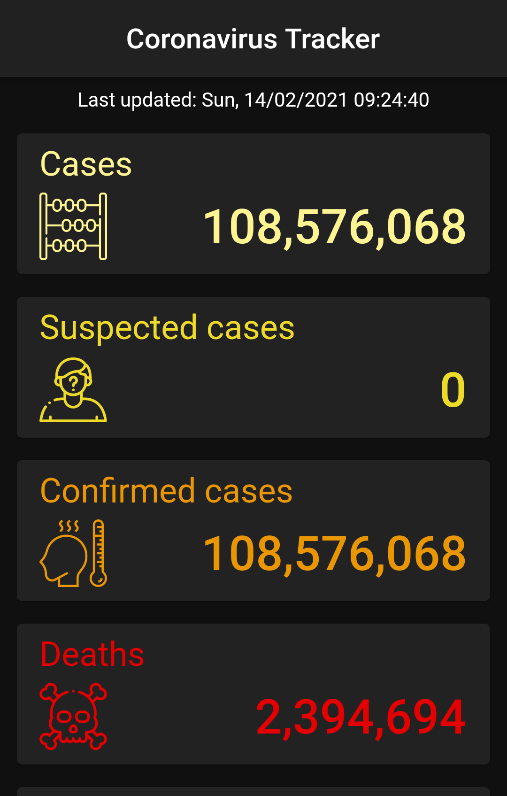

# Corona-Virus Tracker
Track the latest info of the virus around the world in dark theme created by Flutter framework.

 

## Table of contents
* [General info](#general-info)
* [Technologies](#technologies)
* [Launch](#launch)
* [Setup](#setup)
* [Example of use](#example-of-use)
* [Instructions](#instructions)

 
 

## General info
Now you can know the latest information of this Virus e.g. 'number of cases', 'number of deaths' and another info.

 

## Technologies
Project is created with:
* Dart as programming language
* Flutter as framework of Dart
* State Management using [Provider](https://pub.dev/packages/provider "Provider package")
* REST-API from [nCov2019](https://ncov2019-admin.firebaseapp.com/ "nCov2019 Dashboard")

 

## Launch
1. connect you real device / emulator (Android) / simulator (IOS)
1. open lib folder
2. run [main.dart](lib/main.dart)

 

## Setup
1. visit [Flutter](https://flutter.dev/docs/get-started/install "Flutter setup page")
2. choose your operating system
3. follow the instructions to install Flutter successfully
4. install [provider package](https://pub.dev/packages/provider/install "Provider package installation")
5. install [shared preferences package](https://pub.dev/packages/shared_preferences/install "Shared preferences package installation")
6. install [http package](https://pub.dev/packages/http/install "Http package installation")
7. install [intl package](https://pub.dev/packages/intl/install "Intl package installation")

 

## Example of use
 

 

 

## Instructions
If you want to download this project and use it, please follow these instructions :
1. Open the [nCov2019 API](https://ncov2019-admin.firebaseapp.com/ "nCov2019 Dashboard") website
2. Sign-In using Email&Password or Google account
3. From Authorization Keys copy Sandbox key
4. Back to project again and open [api_keys.dart](lib/app/services/api_keys.dart)
5. Paste the copied Sanbox key
6. Run the project and then the access token will generate automatically